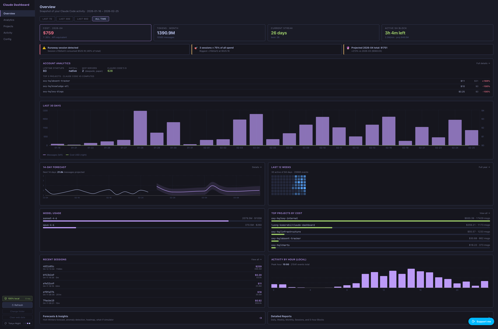

# Claude Dashboard

[](https://ko-fi.com/H2H71LA8V)

A fully client-side dashboard for `~/.claude`. Reads your Claude Code data directly in the browser, never sends a byte over the network. Forecasts, cost tracking, heatmap, and a what-if simulator — all powered by Rust/WASM.



## Quickstart

**Open [luong-komorebi.github.io/claude-dashboard](https://luong-komorebi.github.io/claude-dashboard/) → click "Open ~/.claude folder" → pick your home or `.claude` folder. Done.**

The app walks you through the 3-click picker flow on first visit (including a copy-path helper for macOS `⇧⌘G` / Windows address-bar paste).

## Features

- **Overview** — cost, streak, active 5h block, top insights, 14-day forecast preview, mini heatmap, model + project breakdown, recent sessions, hour-of-day pattern, budget tracker
- **Analytics** — full Reports tables · Holt-Winters forecast · year-calendar heatmap · what-if cost simulator
- **Projects** — path-tree with memory-file search (lossless — uses real `cwd` from session logs)
- **Activity · Config** — searchable sessions, usage facets, todos, plans, plugins, settings, command history
- **14 themes** — Tokyo Night (default), GitHub Dark/Light, Catppuccin, Dracula, Nord, Gruvbox, Rosé Pine, One Dark, Solarized, Monokai, …

## Offline use

Three ways to run without internet:

1. **PWA install** — visit the hosted URL once online, click the in-app Install button; service worker precaches everything. Works forever after that.
2. **Standalone binary** — one-liner for macOS / Linux:

   ```bash
   curl -sSfL https://raw.githubusercontent.com/luong-komorebi/claude-dashboard/main/scripts/install.sh | bash
   ```

   Auto-detects your platform, downloads the latest release to `~/.local/bin/claude-dashboard`, and prints the command to run it. Pin a version with `VERSION=v0.2.0`. Change target dir with `INSTALL_DIR=/usr/local/bin`. Windows users: grab `claude-dashboard-windows-x64.exe` from the [Releases page](../../releases) manually.

   Embeds the full web app in a ~1.5 MB single binary. No runtime deps. Serves on `http://localhost:7878` and auto-opens your browser.
3. **Build from source** — see [DEVELOPMENT.md](./DEVELOPMENT.md).

## Privacy

- `Content-Security-Policy: connect-src 'self'` physically blocks outbound connections — verifiable in DevTools → Network (shows 0 external requests)
- No telemetry, no analytics, no third-party scripts
- All parsing + analytics runs locally in a Web Worker + Rust/WASM
- Persistent storage API enabled on request so the browser never evicts your folder handle
- OAuth tokens, MCP server credentials, and any other secrets in `.claude.json` are stripped **inside the Web Worker** before reaching the main thread — they never touch the UI or get persisted to OPFS

## What gets read (and what doesn't)

Quick map of `~/.claude` so you know exactly what the dashboard sees.

### Currently parsed

| Path | Used for | Notes |
|---|---|---|
| `stats-cache.json` | Daily activity rollups (messages, sessions, tool calls) | StatsData |
| `usage-data/facets/*.json` | Session summaries (outcome, helpfulness, brief) | UsageData |
| `projects/<id>/*.jsonl` | Per-session event logs → token usage, cost, real `cwd` | UsageEvents + Reports |
| `projects/<id>/memory/*.md` | Project memory files | Projects tree |
| `plugins/installed_plugins.json` + `settings.json#enabledPlugins` | Plugin registry | Plugins page |
| `settings.json` | Allowed tools, effort level, always-thinking | Settings page |
| `history.jsonl` | Recent CLI command history | Settings page |
| `todos/<sessionId>-agent-<id>.json` | Per-session todo lists | Activity → Todos |
| `plans/*.md` | Implementation plans | Activity → Todos |
| `~/.claude.json` *(sibling, not inside)* | **Account info, per-project lastCost, MCP server names, numStartups** | Account tab — requires picking the file via the in-app "Pick .claude.json" button |

### Redacted before reaching the UI

These exist in the source files but are stripped inside the Web Worker and never persisted:

- `oauthAccount.accessToken` — Anthropic OAuth access token
- `oauthAccount.refreshToken` — refresh token
- `mcpServers.*.env` — environment variables passed to MCP servers (often API keys)
- `mcpServers.*.headers` — HTTP headers (auth tokens for SSE/HTTP MCP transports)
- Any other `apiKey` / `token` / `password` field nested under `mcpServers`

The Account tab shows MCP server **names only**.

### Not yet parsed (gaps)

| Path | What it contains | Why not yet |
|---|---|---|
| `cache/changelog.md` | Claude Code's own version-by-version changelog | Could surface as "What's new" card — easy add |
| `commands/*.md` | User-defined slash commands (YAML frontmatter + body) | Could become "Custom commands" tab — easy add |
| `skills/*/SKILL.md` | User-defined skills with metadata + scripts | Could become "Custom skills" tab — easy add |
| `file-history/<sessionId>/<hash>@v<n>` | Versioned snapshots of every file Claude has edited (~37 MB on this machine) | Big payload; useful for "files most touched" stat or undo-trail viewer |
| `sessions/<pid>.json` | Currently-running Claude Code processes (pid, cwd, entrypoint) | Could power a "live sessions" widget — small add |
| `ide/<pid>.lock` | Connected IDE extensions (VS Code, JetBrains) with workspace folders | Tokens must be redacted; useful for "connected editors" widget |
| `statsig/statsig.cached.evaluations.*` | Feature flags + cached gates Claude Code evaluates against | Fun "experiments you're in" view — small add |
| `telemetry/1p_failed_events.*.json` | Failed telemetry events Claude Code couldn't ship to Anthropic (~15 MB) | Mostly noise — error reports, performance metrics. Low value. |
| `shell-snapshots/*.sh` | Zsh/bash startup snapshots captured per session (~241 MB on this machine) | Huge, low signal. Skipped. |
| `debug/<sessionId>.txt` | Plain-text debug logs per session | Useful for troubleshooting; not actionable for a usage dashboard |
| `tasks/<uuid>/` | Task-related metadata | Empty on most installs |
| `backups/`, `session-env/` | Backup files, per-session env overrides | Generally empty or low value |

### What's NOT in `~/.claude` at all

These would require Anthropic's API (online mode, not yet implemented):

- **Subscription tier** (Pro / Max / API)
- **Live quota / 5-hour block remaining tokens**
- **Billing reset times**
- **Actual invoiced amount** (we show *API-equivalent* cost computed from token counts × LiteLLM pricing — that's hypothetical, not what subscription users actually pay)

Online mode is on the roadmap as an opt-in toggle that would relax the CSP to allow `api.anthropic.com` and surface the live numbers — see [DEVELOPMENT.md](./DEVELOPMENT.md) for the proposed architecture.

## Support

If this saves you time, a tip keeps the project going:

[](https://ko-fi.com/H2H71LA8V)

The in-app "Support me" button is a plain `<a>` link — no Ko-fi scripts load until you click. The privacy badge stays green.

---

**Contributing?** See [DEVELOPMENT.md](./DEVELOPMENT.md) for setup, architecture, release process, and everything else.
